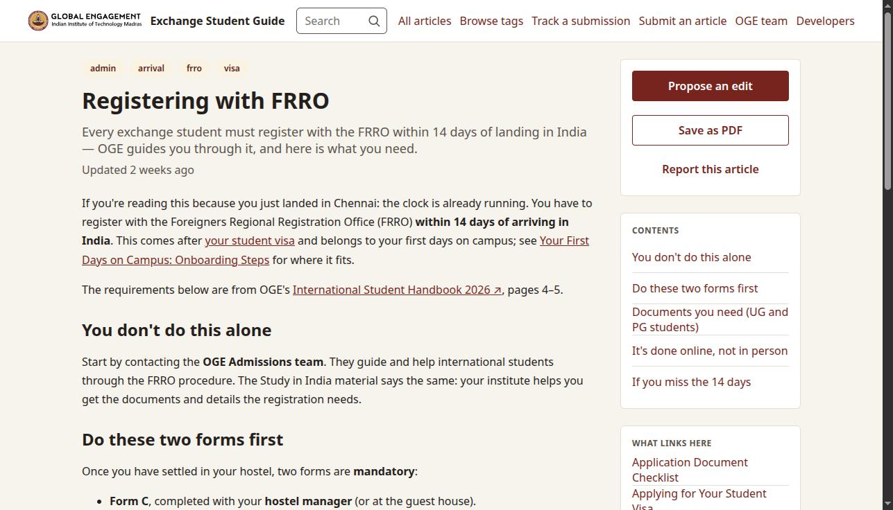
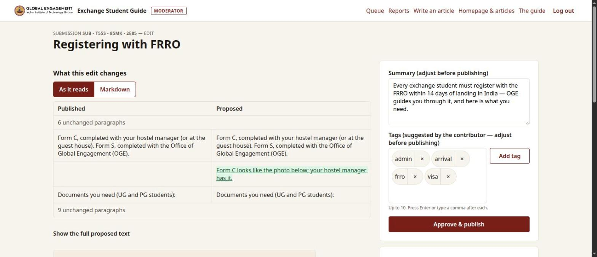

# Exchange Student Guide Platform

A community-editable knowledge base for incoming exchange students at IIT Madras. Anyone can write
an article — how to register with FRRO, how hostel check-in works, where to find good biryani — and
every article and edit passes through a moderation queue owned by the Office of Global Engagement.

The problem it solves: the information exists, but it is scattered across the IITM site, WhatsApp
groups and travel blogs, and a student who arrived three days ago cannot find it.

CS5013 "Programming with AI" course project.
Stakeholder: Mr. Thukaram M Damodhar, Lead — International Academic Programs, OGE, IIT Madras.

## What it does



- **Read and search.** 38 starter articles written from OGE's International Student Handbook 2026.
  Search matches every word and marks it in a passage; articles link to each other with `[[Title]]`,
  a link to an article nobody has written yet shows in red and invites a reader to write it, and each
  article lists what links to it. Tags, with how many articles carry each.
- **Contribute without an account.** A Markdown editor with a live preview and a draft kept in the
  browser, tags as chips, a photo, PDF or video dropped onto the form. A submission gets a number the
  student uses to follow it; nothing is public until a moderator approves it.
- **Moderate.** A queue; an edit shown as a diff of the text as it reads; approve with the summary and
  tags adjusted, or reject with a reason. Moderators can also publish or edit directly, pin articles
  to the home page, remove one, and answer readers' reports. Earlier versions are kept.
- **For everyone.** Works from a 320 px phone to a wide screen, from the keyboard alone, and with
  text in English, Hindi and Tamil; an article saves as a PDF.



## Status

The main flow is built and runs end to end on a reset stand
([docs/course/mid-demo.md](docs/course/mid-demo.md)). Of 43 functional and non-functional requirements
42 are done; the one left, completing a wiki link while typing it (FR-028, a *should*), is planned.
Five technical debt entries are open, each with the event that makes it urgent. Both lists are
generated, not written: [docs/gap-list.md](docs/gap-list.md).

Phases 0–2 are closed; phase 3 has its last process items open, and most of phase 4's hardening was
done during it. Ahead: the meeting with OGE on the working stand, the stakeholder using it himself,
and the viva ([docs/roadmap/](docs/roadmap/)).

**Delivered to the course:** the proposal, the design document, the mid-demo report and the
mid-evaluation's Principles & Practices document, all in [docs/course/](docs/course/). The final
submission is due on 6 November.

## Who should read what

| You are | Start at |
|---|---|
| at OGE, moderating the guide | [docs/handoff/moderator-guide.md](docs/handoff/moderator-guide.md) |
| installing or running it (IITM's IT) | [docs/handoff/install.md](docs/handoff/install.md), then [backup.md](docs/handoff/backup.md) |
| a developer changing the code | [docs/viva/README.md](docs/viva/README.md) (a map of the code), [docs/repository-map.md](docs/repository-map.md) |
| grading the course project | [docs/course/rubric.md](docs/course/rubric.md), [docs/ai/journal/](docs/ai/journal/) |

## Getting started

**Setting up for the first time: [docs/onboarding.md](docs/onboarding.md).** Open the repository with
an AI assistant and say "work through docs/onboarding.md": it checks what is missing, asks before
installing anything, and finishes on a criterion rather than on a checklist. It works by hand too, on
macOS, Windows and Linux.

Requires JDK 21. Maven is **not** needed and should not be installed: the wrapper pins the version, so
the build is identical on both our machines and in CI, and a system-wide Maven would be a second way
to build with a possibly different version.

```sh
scripts/hooks.sh                    # build the tooling, install the git hooks — run this first
./mvnw verify                       # build, test, check formatting
./mvnw -pl app -P postgres verify   # the same tests on PostgreSQL 17 (needs Docker); CI's postgres job
./mvnw -pl app -P browser verify    # plus every page in a real browser at four widths (downloads Chromium)
./mvnw -pl app spring-boot:run -Dspring-boot.run.profiles=dev,seed  # http://localhost:8080, with the starter articles
scripts/check.sh                    # everything CI's build job runs, before you push
scripts/diagrams.sh                 # re-render the C4 diagrams and the ERD
scripts/contribution.sh             # who wrote what, per ISO week
```

To run it as OGE will, on PostgreSQL with nothing but Docker:

```sh
cp .env.example .env                # set POSTGRES_PASSWORD, and GUIDE_ADMIN_PASSWORD_HASH to moderate
docker compose up -d --build        # http://localhost:8080; moderators at /moderate/login
scripts/backup.sh                   # a backup of the database and the uploads
```

[docs/handoff/install.md](docs/handoff/install.md) covers the moderator's password, HTTPS behind a
proxy, updating and what to do when something is wrong.

`scripts/hooks.sh` is not optional: most of what the last section describes runs from
`tools/target/ai-tools.jar`, and a missing jar switches all of it off without failing anything.

## Built with

Java 21, Spring Boot 3.5 with Spring Modulith, Thymeleaf, PostgreSQL 17 (H2 in development), Flyway,
Hibernate Search on Lucene, commonmark-java; in the browser EasyMDE, Tom Select, FilePond and
PhotoSwipe, served from WebJars under a strict Content-Security-Policy; Docker Compose to run it.
Every choice with the options it was weighed against: [docs/architecture/adr/](docs/architecture/adr/).

**What checks it.** 638 application tests and 356 for the tools on every push; the same suite on
PostgreSQL in CI; 151 browser tests in Chromium with axe for accessibility at four widths; mutation
testing of the pure logic (130 of 132 mutants killed) and property-based tests of the wiki-link rules;
an upgrade check of the newest image on volumes an older one filled; backups restored and checked.
Records in [docs/verification/](docs/verification/).

## Layout

| Path | What is there |
|---|---|
| `app/` | The Spring Boot application: thirteen slices (`home`, `articleview`, `search`, `contribute`, `moderate`, …) and `shared`, with their tests |
| `tools/` | `ai-tools.jar` — the prompt journal, the hooks, the commit-message gate, the documentation check, the generators |
| `scripts/` | The checks CI runs, backup and restore, the upgrade check, contribution figures |
| `docs/requirements/` | What the system must do: `FR`, `NFR`, `CON`, the glossary, acceptance criteria |
| `docs/architecture/` | ADRs, the C4 diagrams, the data model, the route contract, the security rules |
| `docs/features/` | One file per feature: what was built, its decisions, its acceptance criteria |
| `docs/handoff/` | Everything OGE needs to run the guide without us |
| `docs/roadmap/` | Six phases, each a checklist whose items carry a check that can fail |
| `docs/course/` | The deliverables, with the rubric each is graded against |
| `docs/ai/` | Instructions for the AI agent, and the journal of every prompt given to it |

Full map: [docs/repository-map.md](docs/repository-map.md).

## How this repository is worked in

Both of us use an AI coding assistant, and the repository makes that legible. Each line says what
enforces it, because a planned mechanism and one that fires are different things.

- **Prompts, results and our own hand edits are recorded** in [docs/ai/journal/](docs/ai/journal/),
  written by hooks as the work happens and committed automatically. A prompt written in Russian will
  not let the turn end until an English rendering is supplied, one per prompt of the turn, since the
  journal is evidence for an English-speaking reader.
- **A contract before any change.** The assistant states the goal, boundaries, acceptance criteria
  and open questions, and waits for a "yes" ([docs/ai/prompting.md](docs/ai/prompting.md)); a hook
  repeats the rule with every prompt. Requirements, ADRs, the route contract and the schema change
  only with the human's approval.
- **Decisions are recorded when they are taken**, in [docs/architecture/adr/](docs/architecture/adr/),
  each with the options weighed. The register says that ADR-0002 to ADR-0008 were written after the
  fact, and why that is weaker.
- **The slice boundary is a test.** `ModularityTest` (Spring Modulith) and `ArchitectureRulesTest`
  (ArchUnit) fail the build when one slice reaches into another's internals.
- **Commit messages and unrecorded shortcuts are gated.** A message outside the convention is refused,
  and so is a parked-work comment with nothing in [docs/tech-debt.md](docs/tech-debt.md) behind it.
- **Documentation is checked against the repository.** A push is refused when a document names a file
  that does not exist, when a generated document is stale, and when a changed controller, schema or
  slice boundary is not described ([docs/ai/docs-sync.md](docs/ai/docs-sync.md)).
- **Requirements trace to code and tests** through anchors in the code. `ai-tools trace` writes
  [docs/traceability.md](docs/traceability.md), and the hooks and CI refuse a gap in the chain or a
  matrix that no longer matches the anchors.
- **Contribution is measured, not declared.** `scripts/contribution.sh` reports authorship per ISO
  week with the journal hook's own commits separated out, because `git shortlog` on this repository
  says the opposite of the truth. `ai-tools ownership` writes
  [docs/team/ownership.md](docs/team/ownership.md) from the same reading, per slice.

The rules the assistant works under are in [CLAUDE.md](CLAUDE.md) and [docs/ai/](docs/ai/). That layer
is itself under review: [docs/ai/instruction-backlog.md](docs/ai/instruction-backlog.md) IB-003 asks
why so much instruction produced so little compliance, and answers that most of it has no moment at
which it arrives; [docs/ai/audit-2026-09-21.md](docs/ai/audit-2026-09-21.md) records the latest audit.

## Team

| | | |
|---|---|---|
| Mikhail Novikov | GE26Z858, [@rikire](https://github.com/rikire) | rizireY@yandex.ru |
| Abdirakhim Ismailov | GE26Z860, [@abdra04-gif](https://github.com/abdra04-gif) | abdraoper@gmail.com |

## Licence

[MIT](LICENSE).
