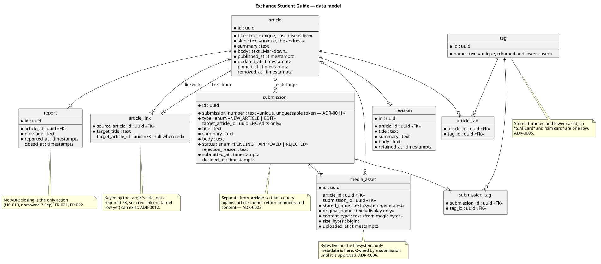

# Data model

Tables, relations, and why each exists. Written 10 September, phase 1.

Source: [docs/diagrams/src/erd.puml](../diagrams/src/erd.puml). Refresh the rendering with
`scripts/diagrams.sh`.

Every table below names the ADR that decided it. One does not have one, and that is flagged rather
than smoothed over.

## Content

| Table | Holds | Decided by |
|---|---|---|
| `article` | Published content only | [ADR-0003](adr/ADR-0003-moderation-and-revision-storage.md) |
| `revision` | An article's title, summary and body as they stood before an approved edit | [ADR-0003](adr/ADR-0003-moderation-and-revision-storage.md), and [CON-004](../requirements/constraints.md) — full copies, because there is no diff view |
| `tag`, `article_tag` | Free-form labels, normalised on the way in | [ADR-0005](adr/ADR-0005-taxonomy.md) |

**`article` holds nothing unpublished.** That is the whole point of the split: FR-001, FR-007 and
FR-008 each carry a negative criterion — an unapproved or rejected submission must not resolve,
must not appear in search, must not appear under a tag — and those hold because the rows are absent,
not because ten repositories each remembered a status filter.

**Two timestamps, not one.** `published_at` is set once and never moved; `updated_at` starts equal to
it and moves forward with each approved edit. FR-009's "most recently added" reads the first; the
"Updated 3 days ago" line on the tag-browse screen reads the second. A single timestamp would have
made FR-009 silently mean "recently changed".

**`summary` is stored, not derived.** It is written by the contributor (FR-010, FR-011) and
adjustable by the moderator (FR-017), and it appears wherever articles are listed rather than read.
The ellipsed extract in search results is a different thing — computed around the match at query
time and stored nowhere.

## Moderation

| Table | Holds | Decided by |
|---|---|---|
| `submission`, `submission_tag` | A proposed new article or edit, its status, its number, its rejection reason | [ADR-0003](adr/ADR-0003-moderation-and-revision-storage.md) |

`type` distinguishes a new-article submission from an edit; `target_article_id` is set only for
edits. `status` is the three values FR-012 shows and nothing else.

An earlier draft of this diagram carried a `submitter_ip_hash` column for
[NFR-005](../requirements/non-functional.md)'s rate limit. It was removed on review:
[ADR-0008](adr/ADR-0008-abuse-handling-without-accounts.md) deliberately leaves *where the rate
limit is counted* open, and a column here would have decided it — badly, because FR-013 rejects a
submission **before** any row exists, so a counter living on the table being inserted into cannot
serve the rejection path at all.

The cost, named in ADR-0003 and visible in the diagram: the authored fields appear in three tables.
Adding one means adding it in three places, which is exactly what `summary` needed on 10 September.

## Media and reports

| Table | Holds | Decided by |
|---|---|---|
| `media_asset` | Metadata only — the bytes are on the filesystem | [ADR-0006](adr/ADR-0006-media-storage-and-upload-security.md) |
| `report` | A reader's flag on a published article, with the required message | FR-021, FR-022 |

`media_asset` points at either an article or a submission, never both: it belongs to the submission
until approval moves it across. `content_type` is what Tika read from the magic bytes, not what the
client claimed. `stored_name` is generated by the system and `original_name` is display-only — the
rule that closes path traversal.

`report` is closed by setting `closed_at`. There is no accept/reject decision on a report itself:
UC-019 was narrowed on 7 September so that correcting an article reuses the existing direct-edit
capability, and closing is the only new action.

## The one table no ADR decided

**`article_link`** carries FR-006's backlinks — which articles link to this one — and FR-004's red
links. It is drawn in the diagram because backlinks need somewhere to come from, and it is named
here because the decision behind it has not been made:

- **Store the links**, extracted when an article is published, as the diagram shows. Backlinks are
  an indexed lookup and red links are known without parsing anything. The table has to be kept in
  step with the body on every publish, and a stale row means a wrong link colour.
- **Derive them**, by scanning bodies at read time. Nothing to keep in step, and no possibility of
  drift — but "what links here" becomes a scan of every article, which
  [ADR-0010](adr/ADR-0010-bounded-reads.md) is precisely about not doing on a public page.

FR-006 is `could` and FR-004 is `must`, so the two halves do not have the same urgency. This wants
its own ADR before either is built; recording it here is not the same as deciding it.

## Open decisions found while reviewing this model

Three, from checking every `FR` and every screen against the diagram on 10 September. None is
decided here — entity fields, cardinality and enum values are the human's call
(`.claude/rules/schema.md`).

**1. A removed article has no representation.** FR-026 is `should` and says a removed article stops
resolving, leaves search, tag listings and the landing page, and turns links to it red. The model
has no `removed_at` and no state on `article`, so removal reads as a hard `DELETE` — which would
take FR-020's retained revisions with it, and FR-020 exists precisely so that content survives a
change. It would also strand `report.article_id` and any `submission.target_article_id` pointing at
it. The two shapes are a soft-delete column on `article`, or a hard delete with an explicit answer
for revisions, reports and pending edits. ADR-0003's own argument applies: choosing this later means
migrating live rows.

**2. `pinned` is a boolean, so pinned articles have no order.** FR-009 shows pinned articles ahead
of recent ones and FR-025 pins and unpins, but neither says what orders two pinned articles against
each other — while [the landing screen](../design/screens/Landing.html) shows two of them in a
definite order. A boolean cannot express that; an integer position or a `pinned_at` timestamp can.

**3. Where the rate limit is counted**, per the removed column above — in-process, or a table of its
own. [ADR-0008](adr/ADR-0008-abuse-handling-without-accounts.md) left it to the implementation, and
that is still where it sits; it is listed here so the absence is visible in the schema rather than
only in the ADR.

## Not in this model

No user table — [CON-001](../requirements/constraints.md), and the moderator is a shared password
([ADR-0009](adr/ADR-0009-admin-authentication.md)). No discussion pages (CON-002), no watchlists
(CON-003), no stored diffs (CON-004).
