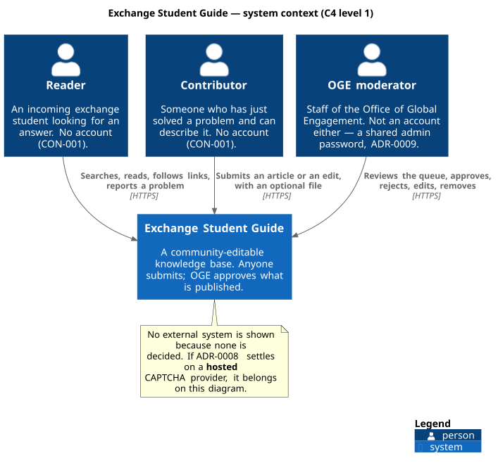
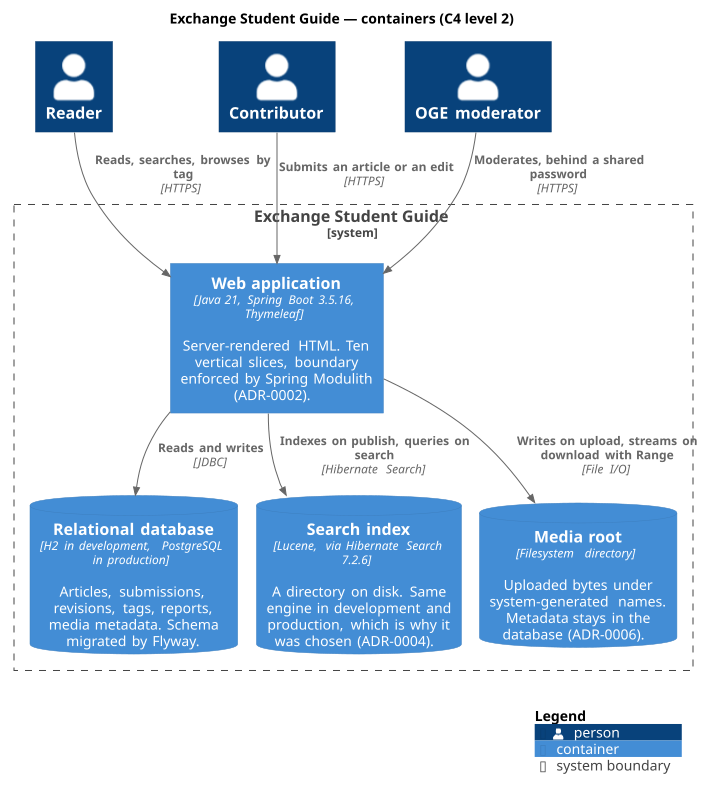
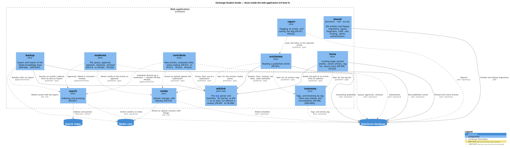

# Architecture overview

C4 levels 1–3 and the slice map. Written 10 September, phase 1.

Diagram sources are in [docs/diagrams/src/](../diagrams/src/); rendered SVGs are in
`docs/diagrams/out/`, which is generated — refresh it with `scripts/diagrams.sh` rather than editing
it. The script fetches a pinned, checksummed PlantUML into a gitignored cache; nothing is added to a
pom, because PlantUML's artifact is GPL and this repository is MIT.

## Level 1 — system context

Three human roles and no external system. Inbound, that is settled:
[CON-008](../requirements/constraints.md) decided there is no machine-facing API and every response
is HTML for a person in a browser, so nothing consumes this system.

Outbound is not settled, and the diagram says so rather than implying it is.
[security.md](security.md) forbids fetching any URL a *visitor* supplies, which closes SSRF — it
does not mean the application calls nothing. [ADR-0008](adr/ADR-0008-abuse-handling-without-accounts.md)
deliberately leaves the CAPTCHA provider open, and a **hosted** one would be an external system on
this diagram. Choosing it is the moment to redraw level 1.

None of the three roles is an account. Readers and contributors have none by
[CON-001](../requirements/constraints.md); the moderator reaches the admin area through a single
shared password ([ADR-0009](adr/ADR-0009-admin-authentication.md)).

## Level 2 — containers

One deployable application and **three** stores, which is the fact this level exists to make
visible:

| Store | What it holds | Decided by |
|---|---|---|
| Relational database | Articles, submissions, revisions, tags, reports, media metadata | Flyway-migrated; shape in [data-model.md](data-model.md) |
| Search index | A Lucene directory on disk | [ADR-0004](adr/ADR-0004-search-and-multilingual-content.md) |
| Media root | Uploaded bytes under system-generated names | [ADR-0006](adr/ADR-0006-media-storage-and-upload-security.md) |

The consequence is operational and belongs in [docs/handoff/](../handoff/): a backup that captures
only the database restores an application whose search returns nothing and whose downloads are
broken. Both extra stores were chosen with that cost named in their ADRs.

H2 in development and PostgreSQL in production is a standing constraint on every decision at this
level — it is what ruled out PostgreSQL full-text search, because the tests would then run against
an engine the product does not ship on.

## Level 3 — slices

Ten vertical slices plus `shared`. The list is owned by
[architecture-rules.md](../ai/architecture-rules.md); the decision to structure the application this
way, and the two alternatives weighed against it, are in
[ADR-0002](adr/ADR-0002-vertical-slices-on-spring-modulith.md).

**Declared in code since 10 September, and verified by the build.** Each of the eleven is a package
under `in.ac.iitm.guide` carrying a `package-info.java`, which is all Spring Modulith needs to treat
it as an application module — so the diagram above and the module list the build sees are the same
list, and a slice added to one without the other fails a test. The packages are otherwise **empty**:
this declares the boundary, it does not implement a slice. The first working slice is phase 2's
first step ([02-skeleton.md](../roadmap/02-skeleton.md)).

Worth stating because the alternative is the usual one: before this, `ModularityTest` called
`ApplicationModules.of(...).verify()` against an application with no modules at all. It passed —
there was no boundary to violate — and had passed since the skeleton was created, proving nothing.
`every_slice_in_the_architecture_map_is_a_module` now asserts the eleven names against the list
above, so an empty pass and a real pass are distinguishable. One consequence is open and recorded:
`shared` is a *closed* module and has to become an open one before the first entity lands
(DEBT-003).

Every arrow on the diagram is one of exactly two channels — a type published directly in a slice
package, or a Spring `ApplicationEvent`. A direct call into another slice's service or repository is
not a channel, and `ModularityTest` fails the build if one appears. The event registry is switched
off, so events are in-process only and nothing replays across a restart.

Two things on the diagram are worth reading twice:

- **`wikilink` is plain Java.** No Spring, no JPA. That is enforced by ArchUnit, and the reason is
  test cost: the link parser is the piece with the most edge cases, and it is the one whose tests run
  without a container.
- **`shared/persistence` is the file both people touch.** ADR-0002 accepts this rather than
  pretending otherwise. Each slice declares its own repository over the shared entities, so the
  entities are common and the queries are not.

## What this overview does not decide

- **Routes.** [ui-routes.md](ui-routes.md) is the contract. Written and reviewed 10 September;
  twelve `must`-priority features routed, the `should`/`could` ones listed there unrouted.
- **Where backlinks come from.** The ERD carries an `article_link` table as a candidate, and no ADR
  decided it — see [data-model.md](data-model.md).
