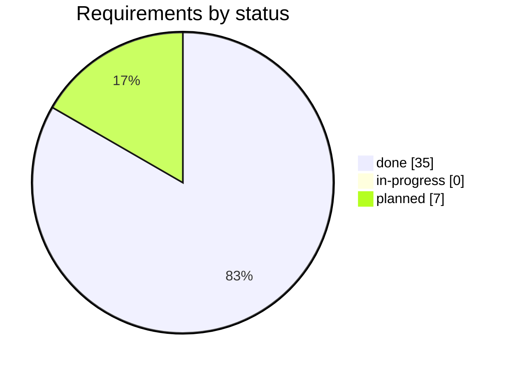
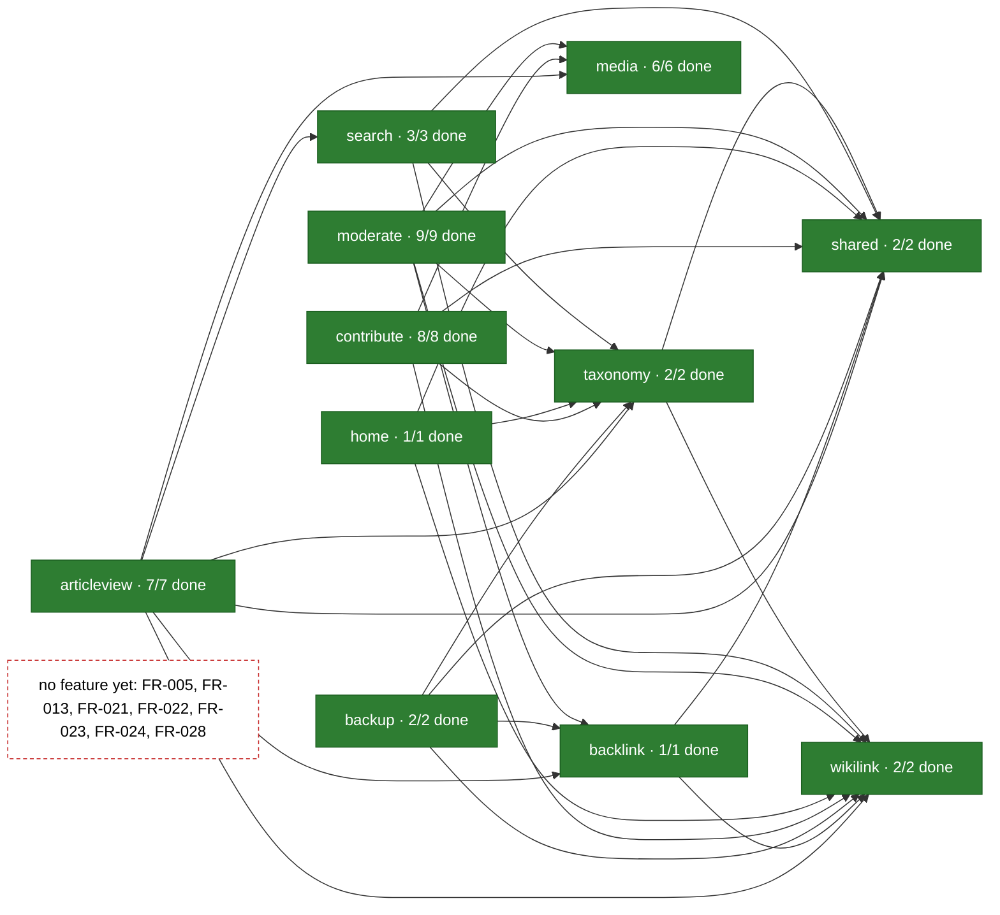

# Gap list

Everything still planned or in progress, every open debt entry, and every requirement whose
acceptance criteria outnumber the tests anchored to it. Hiding a known gap is explicitly worse
than declaring it.

**Generated** by `java -jar tools/target/ai-tools.jar gaps`. An edit made here is lost on the next run.

## Progress

Functional and non-functional requirements by status, out-of-scope ones left out.

Each slice with the requirements its features cover: green when all are done, amber when
some are done or in progress, grey when none has started or no feature names the slice.
The arrows are the dependencies Spring Modulith read from the code (`app/target/spring-modulith-docs/components.puml`, written by `ModularityTest`).

| Slice | Requirements covered | Done | State |
|---|---|---|---|
| articleview | 7 | 7 | done |
| backlink | 1 | 1 | done |
| backup | 2 | 2 | done |
| contribute | 8 | 8 | done |
| home | 1 | 1 | done |
| media | 6 | 6 | done |
| moderate | 9 | 9 | done |
| search | 3 | 3 | done |
| shared | 2 | 2 | done |
| taxonomy | 2 | 2 | done |
| wikilink | 2 | 2 | done |

No feature covers yet: FR-005, FR-013, FR-021, FR-022, FR-023, FR-024, FR-028.

## Requirements not done

"No test, at least" is the criteria minus the tests anchored to the requirement; the
real figure can only be higher.

| Requirement | Status | Priority | Title | Criteria | Tests | No test, at least |
|---|---|---|---|---|---|---|
| FR-005 | planned | could | Creating an article from a red link | 1 | 0 | 1 |
| FR-013 | planned | should | Abuse handling without accounts | 2 | 0 | 2 |
| FR-021 | planned | could | Reporting an article | 2 | 1 | 1 |
| FR-022 | planned | could | Closing a report | 1 | 0 | 1 |
| FR-023 | planned | could | Publishing a new article directly | 4 | 0 | 4 |
| FR-024 | planned | could | Editing an article directly | 4 | 0 | 4 |
| FR-028 | planned | should | Completing a wiki link while writing | 2 | 0 | 2 |

## Done, with criteria that no test is anchored to

None.

## Open technical debt

| Debt | Title | Trigger |
|---|---|---|
| DEBT-015 | A file far over the container's limit gets a closed connection, not the page | the first report of an upload ending in a connection error, or phase 4's hardening. |
| DEBT-014 | The stand's session cookie is not marked `Secure` | the demo stand step of phase 4 ([04-hardening.md](roadmap/04-hardening.md)), and in any |
| DEBT-010 | An article's old address answers `404` after an edit changes its title | the first renamed article anyone complains about, or the phase 4 edge cases, whichever |
| DEBT-002 | The process layer cannot be packaged for a second repository | the first time a second repository needs this, or phase 5 handover — whichever comes |

## Gaps in the traceability chain

None.
