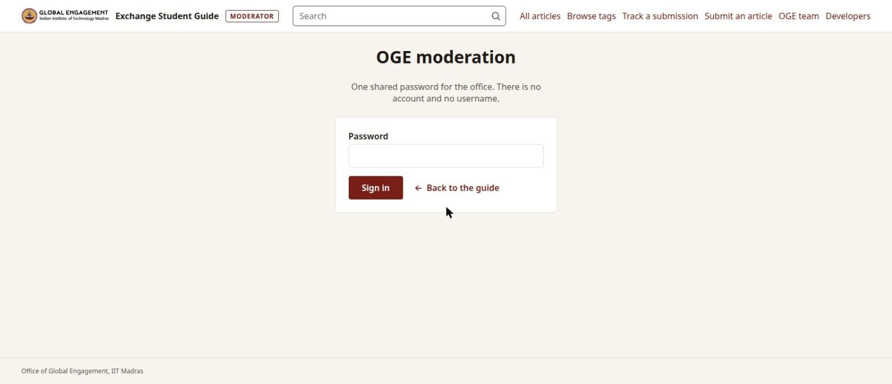
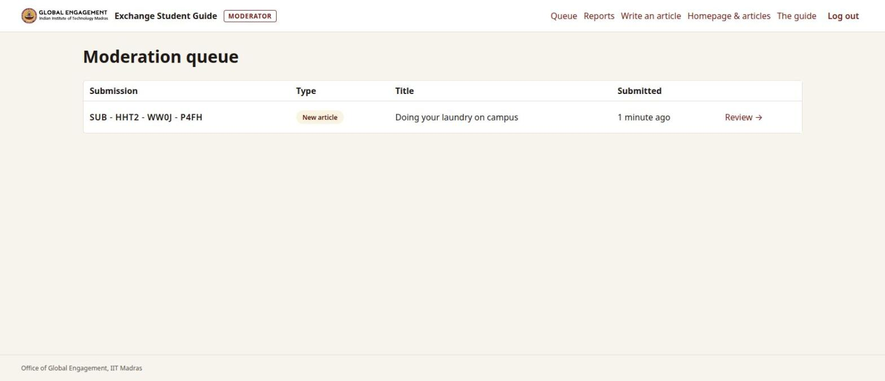
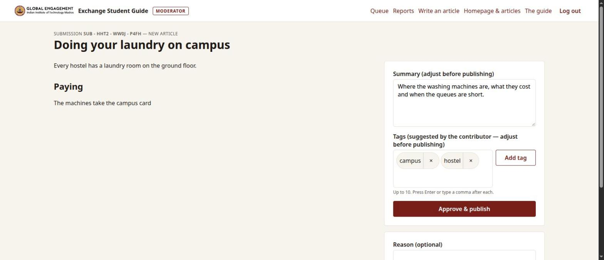
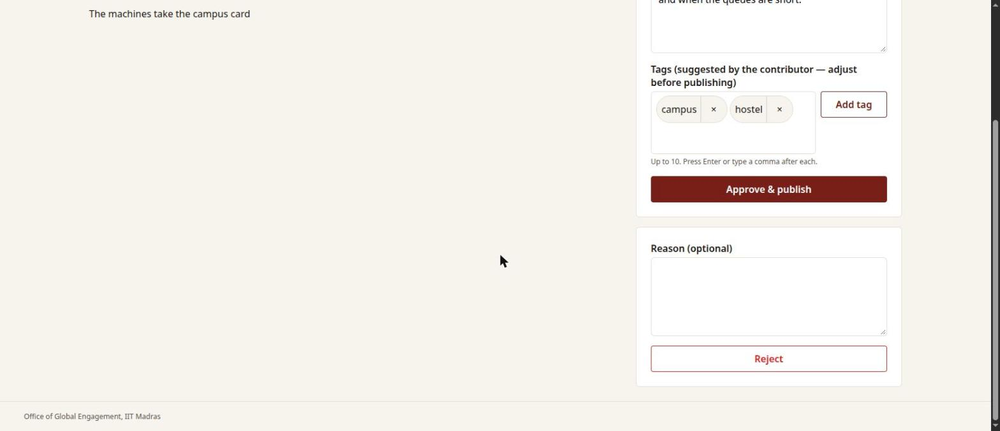
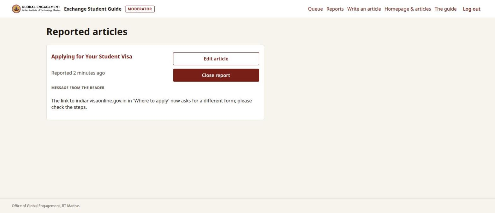
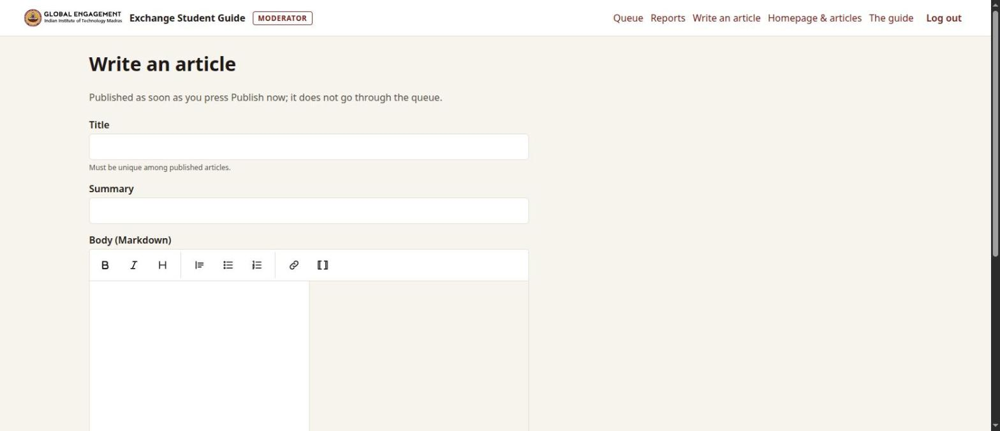
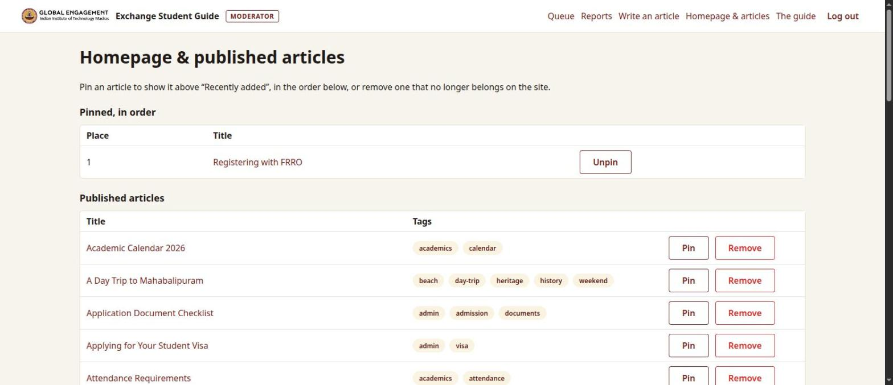

# The moderator's guide

For the staff of the Office of Global Engagement who look after the Exchange Student Guide. No
technical knowledge is needed. Whoever runs the server is in [install.md](install.md).

## What a moderator does

Students write articles and corrections without signing in. **Nothing they send appears on the site
until a moderator approves it.** So the job is: look at what arrived, publish what is right, turn down
what is not, and answer readers who report a problem. A moderator can also write or change an article
directly, and choose which articles stand at the top of the home page.

## Signing in

Go to the guide's address followed by `/moderate/login` (for example `https://guide.iitm.ac.in/moderate/login`;
ask whoever runs the server for the real one). There is no username: the office shares one password.

After ten wrong passwords from one computer, signing in waits for 15 minutes, even with the right
password. When you have finished, press **Log out** at the top right, above all on a shared computer.

## The queue: what students sent

**Queue** shows every submission waiting for a decision, the oldest first: its number, whether it is
a **New article** or an **Edit** of an existing one, whether a photo, document or video came with it,
and when it arrived.

Press **Review →** to open one.

## Reviewing a submission

- For a **new article** you see the text as it will appear.
- For an **edit** you see **what it changes**: the published text and the proposed one side by side,
  added words in green and removed ones struck out; unchanged paragraphs are folded. **As it reads**
  compares the text a reader sees; **Markdown** compares what the student typed. **Show the full
  proposed text** opens the whole article.
- Attached photos, documents and videos are shown under the text. **Watch a video before you approve
  it:** it is published as it was filmed, and a phone's video can record where it was taken.

On the right:

- **Summary** — the one or two sentences shown under the title and on the home page. Correct them if
  needed.
- **Tags** — the student's suggestions. Remove one with ×; add one by typing it and pressing Enter or
  a comma, or by choosing one of the existing tags offered as you type. At most 10.
- **Approve & publish** — the article (or the change) is on the site at once, and search finds it.
  For an edit, the previous version is kept.

### Turning a submission down

Below the approval form: write a **reason** if it helps the student (it is optional), then press
**Reject**. The student sees the decision and the reason when they look up their submission number
under **Track a submission**. The files of a rejected submission are deleted a week later.

## Reports from readers

Under each article readers can **Report this article**: a link that no longer works, a fact that
changed. **Reports** lists them with the reader's message.

**Edit article** opens the article to correct it straight away; **Close report** removes the report
from the list once it is dealt with (or if there is nothing to do).

## Writing or changing an article yourself

**Write an article** publishes at once, without the queue: the same form students use, with title,
summary, text, a file and tags.

The text is written in a simple format: the buttons above it make text **bold**, *italic*, a heading
or a list; the preview beside it shows the result. To link to another article of the guide, write its
title in double square brackets — `[[Registering with FRRO]]` — or use the **[[ ]]** button. A link
to an article that does not exist yet shows in red, and invites a reader to write it.

To change an existing article, open it on the site while signed in: where readers see **Propose an
edit**, a moderator sees **Edit now**. The change is published at once and the previous version is
kept.

## The home page and removing an article

**Homepage & articles** lists every published article.

- **Pin** puts an article at the top of the home page, above "Recently added"; pinned articles are
  shown in the order of the list, and **Move up** and **Move down** change it. **Unpin** takes one
  off.
- **Remove** takes an article off the site after a confirmation page. Use it for an article that no
  longer belongs on the site; for one that is out of date, correct it instead.

**If you change an article's title**, its address changes with it: links to the old address from
outside the site (an e-mail, a printed page) will stop working, and other articles that link to the
old title show that link in red until they are corrected.

## Good to know

- Students have no accounts. Each submission gets a number like `SUB-7QM2-K9XP-4TVB`, which is the
  only way they can follow it; the site never sends e-mail.
- One visitor can send at most five submissions an hour, which keeps a flood of spam out of the queue.
- Photos are re-encoded when they are uploaded, which removes where and when they were taken; videos
  and documents are kept as they came.
- Everything moderators publish, change and remove is kept in the database and in its backups
  ([backup.md](backup.md)).
